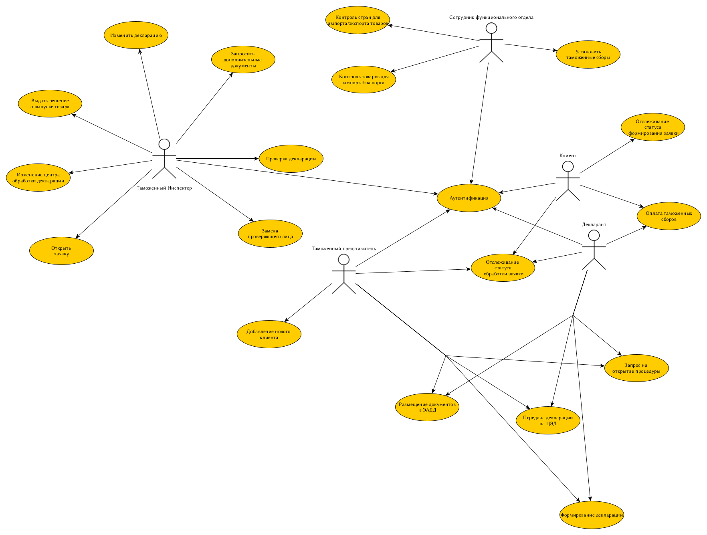

# PPO

:microscope: Repository for PPO course, BMSTU, ICS7, 6th semestr 

## Название проекта: Диспетчеризация таможенных деклараций

### Идея: 
Создать приложение, обрабатывающее поданые  таможенные декларации. 
Декларации распределяются в соответствии с принятым законодательством РФ по отдельным установленным критериям.
Алгоритм распределения должен учитывать следующие критерии:
1. компетенцию таможенного органа;
2. место налогового учета импортера (декларанта);
3. место нахождения товара;
4. время работы ЦЭД.
Проанализировать нагруженность каждого ЦЭДа, рассчитать среднее время обработки каждой декларации в общем, а также на каждом ЦЭДе. 
Расчитать налоговые поступления в бюджет в результате получения таможенных сборов

### Предметная область:

Диспетчеризация таможенных деклараций.
Автоматическое распределение таможенных деклараций на различные Центры Электронного Декларирования  (ЦЭД). 
Таможенное делкарирование необоходимо для передечи информации в таможенные органы о товарах, 
перемещаемых через границу Евразийского экономического союза (ЕЭС), действие необходимое и обязательное для дальнейшего оформления, уплаты платежей, 
соблюдения мер нетарифного регулирования и выпуска этих товаров.

### Краткий анализ аналогичных решений по (минимум) 3 критериям 

| Название | Производитель | Автоматизация процесса декларирования | Возможность локального развертывания | Наличие справочников | Синхронизация с внешним сервером | Создание сопутствующих документов и отчетов |
|    ---   |---|---|---|---| ---| ---|
|    Декларирование товаров | ФТС | Нет | Нет | Нет | Нет | Нет | 
|    ВЭД-Декларант    | ООО «СТМ» | Да | Да |  Да (в т.ч. автокоррекция данных) | Нет | Нет  |
|  Альта-ГТД  |  ООО «Альта-софт»| Да | Да | Да (в т.ч. автокоррекция данных)  | Нет | Да |
|    Контур.Декларант |  АО «Производственная фирма «СКБ Контур» | Ограниченно | Нет | Да | Да | Нет |
|  Магистр-Декларант.ЭД |   ООО «Сигма-софт» |  Нет | Да | Да | Нет | Нет |
|  АСПТД «Декларант» |   ООО «ТКС софт» | Ограниченно  | Да | Ограниченно | Нет | Да |

### Целесообразность:

Текущая система диспетчеризации затрагивает лишь 5% декларационного массива, при этом перераспределяются в основном декларации на импортные товары, которые прибывают авиационным и морским транспортом.
Обработка большего количества деклараций поможет уменьшить среднее время обработки каждой декларации, снизив нагрузку на бюрократический аппарат, тем самым уменьшая операционные затраты каждого из ЦЭДов. 

### Use-Case:
 

### ER-diagram:
 

### Пользовательские сценарии:

#### Декларирование товаров

*Пользователь*: Декларант

*Цель*: Зарегистрировать декларацию на импортируемый товар.

Шаги:
1. Зайти в приложение.
2. Выбрать опцию "Зарегистрировать декларацию".
3. Заполнить информацию о товарах, включая их описание, стоимость, количество и т.д.
4. Проверить правильность заполнения формы.
5. Подписать декларацию и отправить ее на рассмотрение таможенных властей.
6. Проверка таможенной декларации

*Пользователь*: Таможенный инспектор

*Цель*: Проверить декларацию на соответствие требованиям таможенного кодекса.

Шаги:
1. Зайти в приложение.
2. Выбрать опцию "Проверить декларацию".
3. Получить таможенную декларацию на рассмотрение.
4. Проверить информацию в декларации на правильность и соответствие требованиям.
5. Если декларация соответствует требованиям, подтвердить ее и выпустить товары на свободное пользование.
6. Если в декларации есть ошибки, запросить дополнительную информацию или документы.

#### Помощь таможенному представителю

*Пользователь*: Таможенный представитель (брокер)

*Цель*: Подготовить и подать декларацию от имени клиента.

Шаги:
1. Зайти в приложение.
2. Выбрать опцию "Подготовить декларацию".
3. Заполнить информацию о товарах и документах от имени клиента.
4. Проверить правильность заполнения формы.
5. Отправить декларацию на рассмотрение таможенных властей.
6. Получать информацию о статусе декларации и общаться с таможенными сотрудниками через приложение.
7. Мониторинг движения товаров

#### Управление диспетчеризацией

*Пользователь*: Таможенный инспектор

*Цель*: Управлять задачами и контролировать сроки выполнения.

Шаги:
1. Зайти в приложение.
2. Выбрать опцию "Управление декларациями".
3. Просмотреть список поданных деклараций.
4. Переназначить ЦЭД при несоответствии декларации требованиям.
4. Назначить ответственного за выполнение задачи и установить сроки выполнения.
5. Мониторить выполнение задач и получать уведомления о сроках.

#### Отслеживание статуса декларации

*Пользователь*: Клиент

*Цель*: Отслеживать статус таможенного оформления своих грузов.

Шаги:
1. Зайти в приложение.
2. Выбрать опцию "Отслеживание статуса декларации".
3. Ввести номер накладной, ИНН или другой идентификатор груза.
4. Просмотреть текущий статус декларации (например, "В обработке у таможенного сотрудника").
5. Получать уведомления об изменении статуса груза.

#### Изменить условия груза

*Пользователь*: Сотрудник функционального ответа.

*Цель*: Изменить условия выпуска товара согласно новому законодательству.

Шаги:
1. Зайти в приложение.
2. Выбрать опцию "Изменить условия выпуска".
3. Изменить один из следующих параметров: Сумма (процент) таможенных сборов, разрешить/заблокировать товары на импорт или экспорт, разрешить/запретить страну для экспорта или импорта

### BPMN

